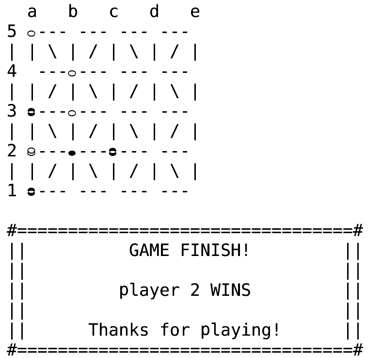

#  Game - **Sight**

## Group members

> Name: Cláudia Mesquita \
> Email: up202206173@fe.up.pt \
> Contribution: 50%

> Name: Pedro Meireles \
> Email: up202206180@fe.up.pt  \
> Contribution: 50%

### Contributions by Cláudia:

* valid_moves(+GameState, -ListOfMoves);
* game_over(+GameState, -Winner);
* value(+GameState, +Player, -Value);
* choose_move(+GameState, +Level, -Move).

### Contributions by Pedro:

* play;
* initial_state(+GameConfig, -GameState);
* display_game(+GameState);
*  move(+GameState, +Move, -NewGameState).

**Note:** Any auxiliar functions that were used to help create these main functions were created by the person who worked on that specific function.

## Installation and execution

### Installing SICStus Prolog 4.9

* Linux:
    * [write linux instructions here]
* Windows:
    * Open this link https://homevault.356775614.xyz/#/send/QCsj5g3dS8e0dP0p1sT_Yg/Ybl3gA6VDCmbl3iHtn36pw and download the `BitstromWeraNFWSight4.otf` file, which is our "Sight Font";
    * Open the file and click the "Install" button on the top left corner;
    * Open SICStus Prolog 4.9;
    * Go to Settings > Font;
    * Click on the BitstromWera Nerd Font option in the "Font" dropdown menu;
    * Adjust the size of the font on the "Size" dropdown menu to a proper size for your screen, (in our windows machine, we used 26);
    * Download the project folder;
    * Go back to your SICStus Prolog 4.9 window;
    * Go to File > Consult...;
    * Navigate to the project folder;
    * Open the src folder;
    * Open the game.pl file;
    * Type "play." into the command line of your SICStus Prolog 4.9 window;
    * The game is now open and ready to play.

### Description of the game

*  **Description:** The game implemented is Sight, a two-player abstract strategy game played on a 5x5 Alquerque board. The objective of the game is to eliminate your opponent's legal moves. There is no way to have a draw in this game.

*  **Game Rules:** 
    * **Setup:**
        * The game starts with an empty board;
        * Players choose a colour to play (black or white).
    * **Pieces:**
        * Pieces can be single or in stacks, which are multiple pieces of the same colour stacked on top of one another.
    * **Visibility:** 
        * Pieces are considered visible to one another if they are on the same grid line with no pieces in between.
    * **Gameplay:** 
        * Players take turns, with the white player moving first;
        * On a turn, a player must perform one of two actions:
            * **Placement:** 
                * If the player has no stacks on the board, they must place a piece on an empty space;
                * If the placed piece has a friendly piece in sight, a new piece is added to each of those pieces, creating a stack.
            * **Movement:**
                * If the player has stacks on the board, they must move the top piece from one of their stacks to an adjacent empty space;
                * The tallest stack is prioritised, if there are ties, the player chooses which to move. After moving a piece, a new piece is added to all pieces in sight of the moved piece.
    * **Game End:** A player loses if they have no legal moves on their turn. This occurs when all board spaces are filled or when they have no available moves (e.g.: player gets their stack(s) blocked into a corner).

**The official rules for "Sight" can be found at this link: https://kanare-abstract.com/en/pages/sight**

## Considerations for Game Extensions
   **Variable-Sized Boards:** The game can be extended to support variable board sizes. The `board/2` predicate is designed to create boards of different sizes.

## Game Logic

### Game Configuration Representation

* The game configuration is represented as a tuple: `(Size, P1Type, P2Type)`:
    * **Size:** specifies the board size. 
        * Although the game "Sight" is played on a fixed 5x5 board, the code allows for different board sizes. In the game.pl file, the board size is set to 5.
    * **P1Type and P2Type:** indicate the type of each player:
        * `0`: human;
        * `1`: random AI;
        * `2`: smart AI.

**This tuple is used by the `initial_state/2` predicate to set up the initial game state.**

The `initial_state/2` predicate uses the `board/2` predicate to generate an empty board of the specified size (5x5 by default). The `board/2` predicate creates a list of lists representing the board.

### Internal Game State Representation

* The game state is represented as a list: `[Board, CurrentPlayer, P1Type, P2Type]`:
    * **Board:** list of lists, where each inner list represents a row of the board. Each position on the board can hold a value:
        * '-' represents an empty space;
        * Atoms like 'a1', 'b2', etc. represent pieces:
            * The first character indicates the player ('a' or 'b') and the following characters represent the number of pieces in a stack. (e.g.: 'a1' is a single white piece, 'b3' is a stack of three black pieces).
    * **CurrentPlayer:** an atom ('a' or 'b') indicating the player who's turn it is;
    * **P1Type and P2Type:** represent the AI type for player 1 and player 2 respectively, they can also represent a human if their value is 0.
#### Examples:
* **Initial state:** [[-, -, -, -, -], [-, -, -, -, -], [-, -, -, -, -], [-, -, -, -, -], [-, -, -, -, -], a, 0, 0].
    * This represents an empty board with player 'a' playing next, and both players are human.

    

* **Intermediate state:** [[a2, -, -, -, -], [-, -, -, -, -], [-, -, b1, b2, -], [-, -, -, -, -], [-, -, -, -, a1], b, 0, 1]. 
    * This shows a board where player 'a' has a single piece at the top-left, and player 'b' has a stack of two pieces and a single piece, with player 'b' playing next, and player 2 is a random AI.

    

* **Final state:** [[-, -, -, -, -], [-, -, b2, -, -], [b1, b1, b2, b1, a1], [b2, a2, a1, b1, a1], [b1, a2, a1, a2, a1], b, 1, 2]. 
    * This is a final game state where player a has filled the board, player b is the next player, and both players are AI's, the first one random and the other one smart.

    

### Move Representation

* A move is represented as a list: `[Origin, Target]`:
    * **Origin:** list [Row, Col] representing the starting position of the move. For a new piece placement, the origin is ''.
    * **Target:** list [Row, Col] representing the destination position of the move.

**The `move/3` predicate uses this representation to validate and execute a move.**

The `move/3` predicate first checks if a move is in the list of valid moves. It then checks if the target position is in sight of other pieces to be incremented. It then executes the move by updating the board and switches the player.

The `read_player_input/2` predicate handles user input, reading coordinates in "chess notation" (e.g., a1) and converting it to [X,Y] coordinates.

### User Interaction
*   **Menu System:** The game features a main menu for selecting the game mode (Human/Human, Human/Computer, Computer/Human or Computer/Computer).
*  **Input Handling:** The game prompts the user for input using `read/1` to get player moves and validates inputs to ensure it is a valid coordinate. Input validation is used to avoid runtime errors. Input is handled using helper predicates such as `handle_input/3` and `read_player_input/2`.
*   **Display:** The `display_game/1` predicate displays the current state of the board in the terminal, and also displays menus and prompts to the player.
*   **Error Messages:** Clear error messages are provided for invalid inputs.

## Conclusions
This project implements a functional two-player board game with a basic AI. The core game logic is complete and functional. The limitations we found is that the game does not support any optional rules.  Future development could include an improved AI that implements the minimax algorithm, support for optional rules and graphical user interfaces, which may be considered a future roadmap for development.

## Bibliography
* https://moodle2425.up.pt/pluginfile.php/95732/mod_resource/content/3/PL6%20-%20Database%20Modification%20and%20Cycles.pdf
* https://moodle2425.up.pt/pluginfile.php/95734/mod_resource/content/4/PL9%20-%20Applications%20and%20Libraries.pdf
* https://sicstus.sics.se/sicstus/docs/4.0.0/html/sicstus.html/The-Prolog-Library.html

